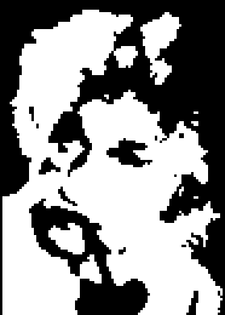
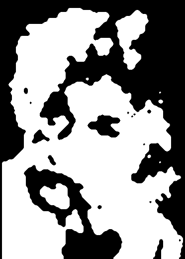
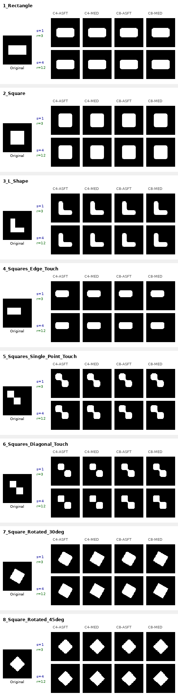

# Topology-Preserving Smoothing - Python Implementation

A Python implementation of the Alternate Sequential Filter controlled by Topology (ASFT) algorithm for smoothing binary images while preserving their topology (number of connected components and holes).

## Example: Einstein Image

| Original | Smoothed (ASFT-MED) | Smoothed (ASFT) |
|:--------:|:-------------------:|:---------------:|
|  |  |  |

*Smoothed with: `-s 1 -r 3 -c 4 --medial`* for ASFT-MED and with the same parameters for the pure ASFT.

The algorithm smooths jagged boundaries while **preserving topology** - all connected components and holes from the original image are maintained.

## More Examples

### Example 1: Complex Structure
| Input | Output |
|:-----:|:------:|
|  |  |

### Example 2: Simple Shape (Connectivity Comparison)
| Input | Output (C8) | Output (C4) |
|:-----:|:-----------:|:-----------:|
|  |  |  |

### Example 3: Organic Form
| Input | Output |
|:-----:|:------:|
|  |  |

## Reference

Based on the paper:
> M. Couprie and G. Bertrand: "Topology preserving alternating sequential filter for smoothing 2D and 3D objects", Journal of Electronic Imaging, Vol. 13, No. 4, pp. 720-730, 2004.

See also the dedicated web-page:
> [Topological Smoothing by M. Couprie, G. Bertrand](https://perso.esiee.fr/~coupriem/ts/index.html)

## Installation

```bash
pip install -r requirements.txt
```

Required packages:
- numpy
- scipy
- Pillow
- numba (optional but highly recommended for 10-100x speedup)

## Supported Image Formats

The algorithm supports any bitmap format readable by Pillow:
- **PNG** (`.png`) - recommended for lossless output
- **JPEG** (`.jpg`, `.jpeg`) - input only (lossy compression not ideal for binary output)
- **PGM** (`.pgm`) - portable graymap, matches C implementation
- **BMP** (`.bmp`)
- **TIFF** (`.tiff`, `.tif`)
- And many others...

The output format is automatically determined by the file extension.

## Usage

### Command Line

```bash
# Basic usage (PNG input/output)
python topology_smoothing.py input.png output.png

# Match C asftmed command: ./asftmed input.pgm 4 3 output.pgm
python topology_smoothing.py input.pgm output.pgm -s 1 -r 3 -c 4

# With all options
python topology_smoothing.py input.jpg output.png \
    -s 1           # Scale factor (default: 4, use 1 to match input dimensions)
    -r 3           # Maximum smoothing radius (default: 3)
    -c 4           # Connectivity: 4 (neighbor) or 8 (next-neighbour)
    -t 128         # Binarization threshold (default: mean intensity)
    --medial       # Use medial axis constraints (default, recommended)
    --no-medial    # Use plain ASFT without medial axis constraints
    --save-binary binary.png  # Save the binarized input image
```

### Python API

```python
from topology_smoothing import topology_preserving_smooth, load_image, asftmed
from PIL import Image
import numpy as np

# Load and process an image
img = load_image('input.png')
smoothed, binary = topology_preserving_smooth(
    img,
    scale=1,           # Scale factor (1 = no scaling, matches C)
    smooth_radius=3,   # Maximum ASFT radius
    connex=4,          # Object connectivity (4 or 8)
    threshold=None,    # Binarization threshold (None = mean)
    use_medial=True    # Use medial axis constraints (recommended)
)

# Save result in any format
Image.fromarray(smoothed).save('output.png')   # PNG
Image.fromarray(smoothed).save('output.jpg')   # JPEG
Image.fromarray(smoothed).save('output.pgm')   # PGM
```

## Parameters

- **scale**: Integer scaling factor. The image is upscaled before smoothing to allow sub-pixel smoothing. Use `scale=1` to match the original image dimensions.

- **smooth_radius (rmax)**: Maximum radius of disk structuring elements. The algorithm applies opening/closing operations with disks of radius 1, 2, ..., rmax. Larger values produce smoother results but take longer.

- **connex**: Object connectivity (4 or 8). For 8-connectivity, diagonal neighbors (white pixels) are considered connected.

- **threshold**: Binarization threshold. Pixels above this value become foreground (255), others become background (0). If None, uses the mean intensity.

- **use_medial / --medial**: When enabled (default), uses medial axis constraints to preserve thin features, recommended.

## Algorithms

### ASFT-MED (default, `--medial`)
Uses medial axes of both foreground and background as constraints. This prevents:
- Thin features from being eroded away
- Small gaps from being filled in


### Plain ASFT (`--no-medial`)
Standard ASFT without constraints. May lose very thin features.


## How It Works

1. **Binarization**: The input image is converted to binary using the threshold.

2. **Scaling** (optional): The binary image is upscaled by the scale factor.

3. **Medial Axis Computation** (ASFT-MED only):
   - Compute medial axis of foreground (skeleton)
   - Compute medial axis of background (inverse skeleton)

4. **ASFT**: For each radius r from 1 to rmax:
   - Apply homotopic pseudo-closing (fills small holes while preserving topology)
   - Apply homotopic pseudo-opening (removes small protrusions while preserving topology)
   - With medial axis constraints, these operations are bounded to preserve thin structures

5. The result is a smoothed binary image with the same topology as the input.

## Performance

- With numba installed: ~1-2 seconds for a 520×372 image with scale=1, radius=3
- Without numba: Much slower (not recommended for large images)

The algorithm scales roughly as O(scale² × rmax × width × height).

## Validation

The Python implementation produces **pixel-perfect results** matching the [C implementation](https://perso.esiee.fr/~coupriem/ts/TS_programs.html).

```bash
# C version
.asftmed test/einstein.pgm 4 3 c_output.pgm

# Python version
python topology_smoothing.py test/einstein.pgm py_output.pgm -s 1 -r 3 -c 4

# Result: 0 pixels different (100% match)
```

Tested with:
- `test/einstein.pgm` (520×372 pixels)
- Connectivity: 4 and 8
- Radius: 1-5

## Test Shapes

Run `python test_shapes.py` to generate comparison panels for various test shapes:

1. **Rectangle** - Grid-aligned rectangle
2. **Square** - Grid-aligned square  
3. **L-Shape** - Grid-aligned L shape
4. **Squares Edge Touch** - Two squares sharing a full edge (1 component for both connectivities)
5. **Squares Single Point Touch** - Two squares touching at exactly one 4-neighbor pixel (1 component for both)
6. **Squares Diagonal Touch** - Two squares touching only at diagonal (2 components for 4-conn, 1 for 8-conn)
7. **Rotated Square 30°** - Square rotated by 30 degrees
8. **Rotated Square 45°** - Square rotated by 45 degrees

Each test shows the original shape and results for:
- Connectivity 4 and 8
- ASFT and ASFT-MED algorithms
- Scale factors 1 and 4

Results are saved to `test_results/` folder, including `all_tests_overview.png` with all shapes combined.

### Sample Test Result


